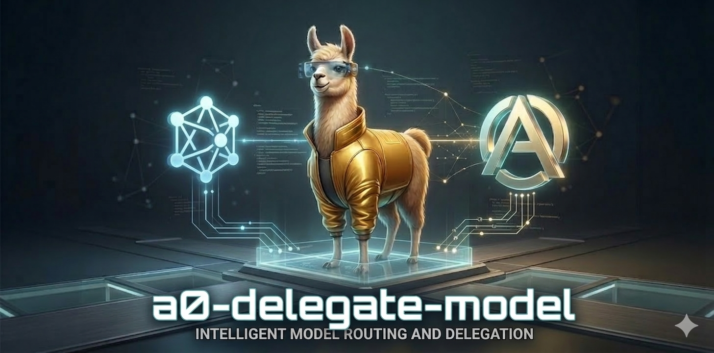

# A0 Delegate Model

---

<div align="center">

</div>

---

**Delegate prompts from Agent Zero to alternative models behind your existing LiteLLM / OpenAI-compatible endpoint.**

[](https://github.com/frdel/agent-zero)
[](https://github.com/BerriAI/litellm)
[](LICENSE)
[](https://www.buymeacoffee.com/mirecekdg)


---

## What it does

**A0 Delegate Model** lets Agent Zero keep using its current chat model while sending selected prompts to a different model exposed by the same LiteLLM-compatible endpoint.

Typical use cases:

- ask **Claude** for a second opinion
- send code tasks to **Codex**
- try **Gemini Flash Lite** for a fast response
- inspect all available models behind your current endpoint
- compare alternatives without changing Agent Zero core config

## Features

- list available models from `/models`
- keep the **current chat model visible**, but move it to the end
- clearly mark the current model as **CURRENTLY USING FOR CHAT**
- delegate a one-off prompt to any available model
- use optional system prompts
- reuse the same OpenAI-compatible endpoint Agent Zero already uses
- avoid exposing API secrets in normal output

## Files

```text
a0-delegate-model/
├── README.md
├── SKILL.md
├── scripts/
│   ├── list_models.py
│   └── delegate_prompt.py
```

## Requirements

This skill assumes an Agent Zero-like setup with:

- settings file at `/a0/usr/settings.json`
- `chat_model_api_base` configured
- `API_KEY_OTHER` available in environment or a known `.env` file

## Helper scripts

### List available models

```bash
python scripts/list_models.py
```

### List available models as JSON

```bash
python scripts/list_models.py --json
```

### Delegate a prompt to a specific model

```bash
python scripts/delegate_prompt.py \
  --model global.anthropic.claude-sonnet-4-6 \
  --prompt "Summarize this architecture and point out weaknesses."
```

### Delegate with a system prompt

```bash
python scripts/delegate_prompt.py \
  --model gpt-5.2-codex \
  --system "You are a senior software engineer." \
  --prompt "Refactor this Python function for clarity and safety."
```

## Example use cases

### Show available models

Ask Agent Zero something like:

```text
What models can you delegate to?
```

### Use another model for coding

```text
Send this coding task to Codex.
```

### Try Gemini instead

```text
Ask Gemini Flash Lite what model family it belongs to.
```

## Security notes

This skill is designed to **avoid exposing secrets** in user-facing output.

It may internally use:

- API keys
- auth headers
- endpoint config

But it should not print raw secrets back to the user.

## Support

If you find this project useful, consider buying me a coffee!

<div align="center">

[](https://www.buymeacoffee.com/mirecekdg)

or

[](https://paypal.me/mirecekd)</div>

## License
MIT
